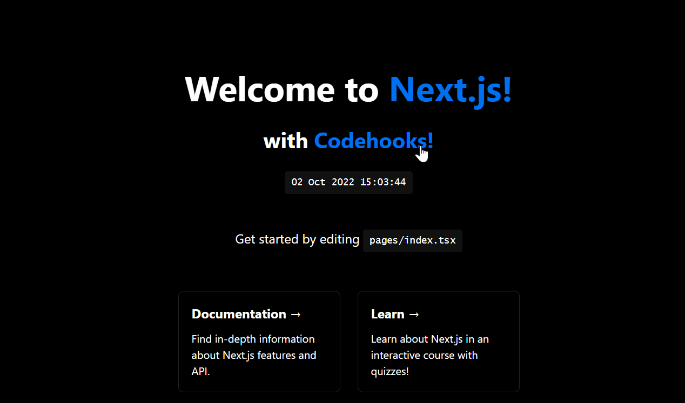

## NextJS Codehooks Socket Example Dev Setup

Please check out the commit history for the steps taken to get this example up and running.



Here's a brief summary:

1. Create a NextJS app with `create-next-app`

```
npx create-next-app@latest --ts
```

2. Install `concurrently` in the NextJS app

```
npm i -D concurrently
```

3. Install `socket.io-client` in the NextJS app

```
npm i socket.io-client
```

Note: The socket packages would ideally come from a package called `@codehooks/socket` or something along those lines. This is just an example.

4. Create a codehooks app in a directory called `api` in the NextJS app

```
mkdir api
cd api
touch index.js
npm init -y
npm i codehooks codehooks-js
npm i -D nodemon
npm i socket.io
```

Basically following this for a [local setup](https://codehooks.io/docs/localdev).

5. Add this line as your `dev` script -- check how the `package.json` file should look like in the api directory.

```json
"scripts": {
    "dev": "nodemon -w . -x coho localserver --port 4000"
  },
```

6. Add this line as your `dev` script -- check how the `package.json` file should look like in the root directory.

```json
"scripts": {
    "dev": "concurrently \"npm run dev --prefix ./api\" \"next dev\"",
  },
```

7. Add an `.env.development.local` file in the root directory that contains the API path to the codehooks app.

```
NEXT_PUBLIC_API_PATH=http://localhost:4000/dev
```

8. Check out the implementation in the `api` directory, but we can enable codehooks do the following:

```js
const socket = new SocketHooks(app);

app.queue(Topics.MAIN, async (req, res) => {
  const { dateTime } = req.body.payload;

  if (!socket) return res.end();

  socket.emit('datetime', dateTime);
  res.end();
});

app.job(Cron.EVERY_SECOND, async (req, res) => {
  const conn = await Datastore.open();

  await conn.enqueue(Topics.MAIN, {
    dateTime: getFormattedDateTime(),
  });

  res.end();
});

app.get('/hello', async (req, res) => {
  console.log('I run locally, cool!');
  res.json({ message: 'Codehooks' });
});

app.socket('hello', (msg) => {
  console.log('Message received from NextJS:', msg);
});

app.socket('hallaisen', (msg) => {
  console.log('Message received from NextJS', msg);
});
```

9. Check out the implementation in the `@codehooks/socket` root directory. We can use the `socket.io-client` to send messages to the codehooks app.

A simple react component implementation below:

```tsx
useEffect(() => {
  const socket = new SocketClient(process.env.NEXT_PUBLIC_API_PATH);

  const connect = async () => {
    await socket.connect();

    socket.on('connect', () => {
      console.log('connected');
    });

    socket.on('datetime', (dateTime: string) => {
      console.log('datetime', dateTime);
    });

    socket.emit('hello', 'Hello from client...');
    socket.emit('hallaisen', 'Hallaisen from client...');
  };

  connect();

  return () => {
    socket.disconnect();
  };
}, []);
```

10. Call the REST endpoint from a component:

```jsx
useEffect(() => {
  fetch(`${process.env.NEXT_PUBLIC_API_PATH}/hello`)
    .then((res) => res.json())
    .then((data) => {
      console.log(data);
    });
}, []);
```
